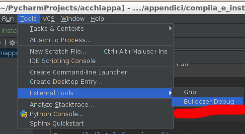
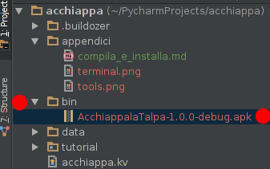
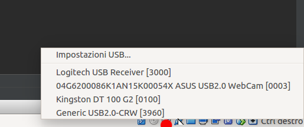
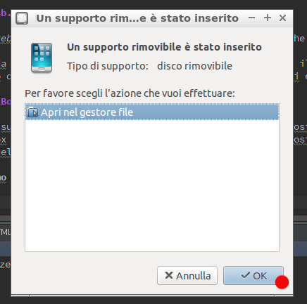
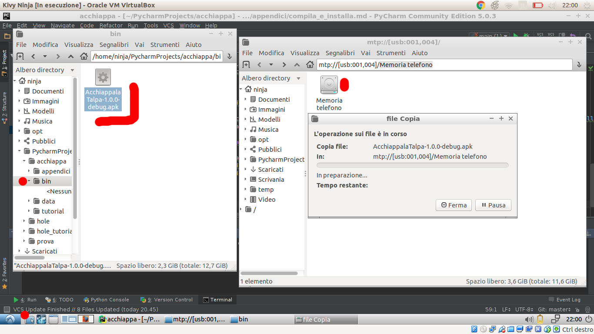

# Compilare E Installare sulla Device

Per costruire la APP bisogna usare un programma che trasforma quello che abbiamo fatto in qualcosa che possiamo 
installare sul telefono.

Andate sul terminale e digitate

```
buildozer android debug deploy run
```

Questa riga esegue il programma `buildozer` per fare una app android in versione `debug`, la copia sul terminale
collegato (`deploy`) e la esegue (`run`).


Oppure per i più pigri...




Una volta costruita la app nella directory `bin` trovate un file che ha un nome del tipo

```
AcchiappalaTalpa-1.0.0-debug.apk
```



Questo è il file che potete caricare sul telefono per instalare la vostra APP.

Se tutto fosse a posto ora sul telefono collegato dovrebbe partire il gioco ma... ci sono troppe cose da fare e
troppi dettagli che possono andare storto: per ora vediamo come fare in maniera sicura.


## Colleghiamo il telefono/tablet al Computer nel Computer

Collegate il vostro telefono con il cavo USB. Questo verrà catturato dal vostro sistema operativo e il computer dentro
virtualbox neanche se ne accorge. Bisogna dire a VirtualBox che vogliamo collegare questo dispositivo al computer che
sta facendo girare.

Proviamo prima la strada veloce: Con il telefono collegato cliccate con il **tasto destro** sul disegno dello spinotto 
USB in basso a destra e selezionate sul menù il vostro telefono.



Ora *dovrebbe* aprirsi una finestra nella macchina virtuale che chiede cosa fare con il telefono: cliccate su OK.



Una strada alternativa è spegnere il computer virtuale usando il simbolo di accessione in basso a destra. Poi sul pannello di 
controllo di VirtualBox cliccate sull'ingranaggio Impostazioni e selezionate USB.


Cliccate sull'icona dello spinotto USB e poi selezionate il vostro telefonino. Ora fate ripartire il coputer di 
virtualbox (i tecnici la chiamano *macchina virtuale*) e il vostro telefono dovrebbe aprirsi nel nuovo computer oltre
che in quello a cui è collegato fisicamente.

## Copiamo e installiamo la APP

Ora la copiamo su telefono:

1. Mettete in primo piano la finestra del telefono
2. Cliccate sul disegno di cartella con puntatore in basso a sinistra
3. Navigate su questa finestra come mostrato in figura per trovare la APP
4. Trascinate la APP sulla memoria del telefono



Ora con un gestore di file del telefono trovate la app e tappate: iniziate l'istallazione.

A seconda del telefono vi potrà chiedere se volete veramente installare questa applicazione insicura e altre menete del
genere. Potrebbe anche essere necessario andare nelle impostazioni e dover indicare che si accettano cose insicure...
spero che il vostro mentor vi possa aiutare.