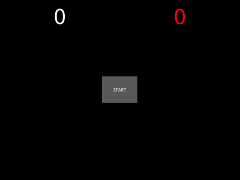

# Bottone di Start

Aggiungeremo un bottone per iniziare deve essere:

1. Contiene la scritta `START`
2. Aggiunto quando il gioco finisce
3. Le talpe iniziano quando viene premuto
2. Rimosso quando inizia il gioco
3. Aggiunto nuovamente quando il gioco finisce
 
## Aggiungiamo il bottone di start

### Il componente

Per prima cosa definiamo l'elemento grafico in `acchiappa.kv`: un bottone di circa un sesto delle dimensioni totali e
messo al centro con scritto `START`.

E' molto simile a quello che abbiamo fatto per `Talpa`, solo che invece d mettere una immagine, dobbiamo mettere il
testo `START`. Quindi in `acchiappa.kv` mettiamo

```kv
<Start>:
    size_hint: 0.15, 0.15
    pos_hint: {"center_x": 0.5, "center_y": 0.5}
    text: 'START'
```

in `main.py` aggiungiamo la classe `Start` che è un sempliebottone:

```python
class Start(Button):
    pass
```

Proviamo... non cambia nulla, infatti da nessuna parte abbiamo detto di aggiungerlo.

### Aggiungiamo quando il gioco finisce

Facciamo ora una funzione `aggiungi_start()` in `AcchiappaLaTalpa` per aggiungere il bottone di start:

```python
    def aggiungi_start(self):
        bottone_start = Start()
        self.add_widget(bottone_start)
```

chiamiamola alla fine della funzione `stop()` per avere il bottone una volta che il gioco è finito

```python
    def stop(self):
        ... altro (NON TOCCARE E NON SCRIVERE)
        self.aggiungi_start()
```

Proviamo .... Ecco comparire il bottone quando il gioco finisce.

### Premere START deve iniziare nuovamente il gioco

Come abbiamo fatto per la talpa nella funzione `talpa()` dobbiamo collegare il bottone a una funzione per il 
bottone premuto. Costruiamo questa funzione `start_premuto()` in `AcchiappaLaTalpa` che per ora chiama semplicemente 
`start()`:

```python
    def start_premuto(self, pressed):
        self.start()
```

Quindi colleghiamola al click del bottone aggiungendo: `self.start_btn.bind(on_press=self.start_premuto)` 
a `aggiungi_start()` che diventa:

```python
    def aggiungi_start(self):
        bottone_start = Start()
        self.add_widget(bottone_start)
        bottone_start.bind(on_press=self.start_premuto)
```

Proviamo, aspettiamo, clicliamo.... e funziona, ma il bottone `START` rimane in mezzo alle scatole.

### Togliere il bottone di START quando viene premuto

Per togliere il bottone potremmo usare `id` come abbiamo fatto per le talpe, ma è uno solo e quindi possiamo fare 
in maniera più diretta: 

1. Aggiungiamo a `AcchiappaLaTalpa` un campo `bottone_start = None`
2. Lo usiamo in `aggiungi_start()` al posto del nome locale `bottone_start`
3. In `start_premuto()` rimuoviamo il bottone con `remove_widget(self.bottone_start)` prima di chiamare `start()`

La classe `AcchiappaLaTalpa` diventa quindi:

```python
class AcchiappaLaTalpa(FloatLayout):
    ... altro (NON TOCCARE E NON SCRIVERE)
    bottone_start = None

    def aggiungi_start(self):
        self.bottone_start = Start()
        self.add_widget(self.bottone_start)
        self.bottone_start.bind(on_press=self.start_premuto)

    def start_premuto(self, pressed):
        self.remove_widget(self.bottone_start)
        self.start()

    ... altro (NON TOCCARE E NON SCRIVERE)
```

### Aggiungiamo START anche all'inizio

E' sufficiente chiamare `aggiungi_start()` al posto di `start()` dove costruiamo il gioco nella classe `AcchiappaApp`
che quindi diventa:

```python
class AcchiappaApp(App):
    def build(self):
        acchiappa = AcchiappaLaTalpa()
        acchiappa.aggiungi_start()
        return acchiappa
```

## Riassumendo




`main.py`

```python
from kivy.animation import Animation
from kivy.app import App
from kivy.clock import Clock
from kivy.uix.button import Button
from kivy.uix.floatlayout import FloatLayout
from kivy.properties import NumericProperty


class Talpa(Button):
    id = "talpa"


class Start(Button):
    pass


class AcchiappaLaTalpa(FloatLayout):
    prese = NumericProperty(0)
    mancate = NumericProperty(0)
    dimansione_talpa = 0.1
    durata_talpa = 2.0
    intervallo_talpe = 1.5
    bottone_start = None

    def aggiungi_start(self):
        self.bottone_start = Start()
        self.add_widget(self.bottone_start)
        self.bottone_start.bind(on_press=self.start_premuto)

    def start_premuto(self, pressed):
        self.remove_widget(self.bottone_start)
        self.start()

    def start(self):
        self.prese = 0
        self.mancate = 0
        Clock.schedule_interval(self.talpa, self.intervallo_talpe)

    def talpa(self, *args):
        talpa = Talpa()
        talpa.bind(on_press=self.talpa_colpita)
        self.add_widget(talpa)
        animazione = Animation(size_hint=(self.dimansione_talpa, self.dimansione_talpa), duration=self.durata_talpa,
                               transition="out_elastic")
        animazione.on_complete = self.talpa_mancata
        animazione.start(talpa)

    def talpa_colpita(self, talpa):
        self.prese += 1
        self.rimuovi_talpa(talpa)

    def talpa_mancata(self, talpa):
        self.mancate += 1
        self.rimuovi_talpa(talpa)

    def rimuovi_talpa(self, talpa):
        Animation.cancel_all(talpa)
        self.remove_widget(talpa)

    def on_mancate(self, instance, mancate):
        if self.mancate == 3:
            self.stop()

    def talpe(self):
        talpe = []
        for talpa in self.children:
            if talpa.id == "talpa":
                talpe.append(talpa)
        return talpe

    def stop(self):
        Clock.unschedule(self.talpa)
        for talpa in self.talpe():
            self.rimuovi_talpa(talpa)
        self.aggiungi_start()


class AcchiappaApp(App):
    def build(self):
        acchiappa = AcchiappaLaTalpa()
        acchiappa.aggiungi_start()
        return acchiappa


if __name__ == "__main__":
    AcchiappaApp().run()
```

`acchiappa.kv`
```kv
#:kivy 1.0.9
#:import random random.random
#:import randint random.randint

<Talpa>:
    size_hint: 0.05, 0.05
    pos_hint: {"center_x": 0.05 + 0.9 * random(), "center_y": 0.05 + 0.9 * random()}
    background_normal: '../data/talpa' + str(randint(1, 5)) + '.jpeg'

<Start>:
    size_hint: 0.15, 0.15
    pos_hint: {"center_x": 0.5, "center_y": 0.5}
    text: 'START'

<AcchiappaLaTalpa>:
    Label:
        size_hint: None, None
        font_size: 70
        pos_hint: {"center_x": 0.25, "top": 0.99}
        text: str(root.prese)

    Label:
        size_hint: None, None
        color: 1,0,0,1
        font_size: 70
        pos_hint: {"center_x": 0.75, "top": 0.99}
        text: str(root.mancate)
```


## Evoluzioni

Adesso cosa possiamo fare?

1. Accelerare il gioco man mano che colpiamo le talpe
2. Cambiare l'animazione delle talpe (magari muovendole anche)
3. Cambiare i colori

### Accelerare
Guardiamo gli ingredienti per il primo punto dicendo che ogni dieci talpe il gioco diventapiù veloce accorciando i 
tempi di un quarto:

1. Quando `prese` diventa *divisibile per 10* (`self.prese / 10 * 10 == self.prese`)
2. Come abbiamo fatto per individuare 3 talpe mancanti useremo la funzione `on_prese()`
3. Cambiamo i valori di `self.durata_talpa *= 0.75` e `self.intervallo_talpe *= 0.75`
4. Facciamo ripartire il l'orologio delle talpe fermandolo e facendolo ripartire (`Clock.unschedule(self.talpa)` e 
`Clock.schedule_interval(self.talpa, self.intervallo_talpe)`)
5. Ricordiamoci di mettere di nuovo i valori originali in `self.durata_talpa` e `self.intervallo_talpe` nella funzione
`start()` (I valori originali si trovano in `AcchiappaLaTalpa.durata_talpa` e `AcchiappaLaTalpa.intervallo_talpe`

### Animazioni

Come abbiamo già detto le animazioni si sommano (una dopo l'altra) o aggiungono in parallelo con `&`.

* [**PREV** Un sacco di talpe](talpe.md)
* [**INDEX** Indice](start.md)
