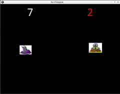

# Un sacco di talpe

Ora ci manca solo far nascere le talpe regolarmente (diciamo ogni secondo e mezzo) e interrompere il gioco quando ne
sbagliamo 3.

# La comparsa delle talpe

Quello che dobbiamo fare è chiamare a intervalli regolari la funzione `talpa()`. Per fare questo usiamo un 
`Clock.schedule_interval(self.talpa, self.intervallo_talpe)` nella funzione `start()` dove : questa riga significa 
*chiama `talpa()` ogni `intervallo_talpe` secondi*. Quindi in alto in `main.py` ricordiamo che vogliamo usare `Clock` 
con

```python
from kivy.clock import Clock
```

e modifichiamo `AcchiappaLaTalpa` e la funzion `start()` come:

```python
class AcchiappaLaTalpa(FloatLayout):
    ... altro (NON TOCCARE E NON SCRIVERE)

    intervallo_talpe = 1.5

    def start(self):
        self.prese = 0
        self.mancate = 0
        Clock.schedule_interval(self.talpa, self.intervallo_talpe)

    ... altro (NON TOCCARE E NON SCRIVERE)
```

## Massimo 3 errori

E' possibile definire una funzione che viene chiamata tutte le volte che una proprietà cambia valore. Questa funzione
deve semplicemente avere il nome `on_<property>` e prendere due argomenti. Facciamo un esempio pratico: se alla
clase `AcchiappaLaTalpa` aggiungiamo la seguente funzione

```python
    def on_mancate(self, instance, mancate):
        print("MANCATE " + str(mancate))
```

vedremo sulla console

```
MANCATE 1
MANCATE 2
MANCATE 3
....
```

... una riga per ogni talpa mancata.

Quindi quando il numero di talpe mancate supera il 3 ... interropiamo l'aggiunta di talpe con 
`Clock.unschedule(self.talpa)`. Quindi:

```python
    def on_mancate(self, instance, mancate):
        if self.mancate == 3:
            Clock.unschedule(self.talpa)
```

**BUG** Le talpe mancate possono diventare 4 e comunque dopo che ne ho mancate 3 posso comunque aumentare le prese.

Prima di risolvere il baco mettiamoci nelle condizioni di poter lavorare comodi: definiamo una funzione `stop()` che
per ora esegue solo `Clock.unschedule(self.talpa)` e chiamiamo questa quando mancate è `3`: questo sarà il punto dove 
faremo l'interruzione.

```python
    def on_mancate(self, instance, mancate):
        if self.mancate == 3:
            self.stop()
    
    def stop(self):
        Clock.unschedule(self.talpa)
```

## Correzzione del Baco

Ora potremmo iniziare a sperimentare un sacco di strade come interrompere l'animazione bloccare i punteggi, ma il vero
problema è che il nostro punto attivo sono le talpe, la cosa migliore è rimuoverle tutte: infatti rimuovendo la talpa
si evita qualsiasi altro evento di punteggio.

E' possibile guardare tutti i componenti dentro a `AcchiappaLaTalpa` con `self.children` e selezionare solo le 
talpe; per farlo dobbiamo mettere un identificativo in tutte le talpe per riconoscerle dalle altre cose come
le scritte. Per fare questo è sufficiente definire il campo `id = "talpa"` nella classe `Talpa` e poi prendere tutti
i componenti con `id == "talpa"`.

Modifichiamo quindi `Talpa`:

```python
class Talpa(Button):
    id = "talpa"
```

E facciamo una funzione `talpe()` in `AcchiappaLaTalpa` che ritorna tutte le talpe presenti tra i figli:
 
```python
    def talpe(self):
        talpe = []
        for talpa in self.children:
            if talpa.id == "talpa":
                talpe.append(talpa)
        return talpe
``` 

Ora ci manca solo rimuovere tutte le talpe nella funzione `stop()` di `AcchiappaLaTalpa`

```python
    def stop(self):
        Clock.unschedule(self.talpa)
        for talpa in self.talpe():
            self.rimuovi_talpa(talpa)
```

**Nota** La funzione `talpe()` poteva essere anche scritta in maniera più concisa:

```python
    def talpe(self):
        return [talpa for talpa in self.children if talpa.id == "talpa"]
``` 

stesso identico risultato... se vi sembra che sia chiara usatela pure. **La cosa più importante è sempre
un programma chiaro e non più lungo o più corto.**

## Riassumendo



`main.py`
```python
from kivy.animation import Animation
from kivy.app import App
from kivy.uix.button import Button
from kivy.uix.floatlayout import FloatLayout
from kivy.properties import NumericProperty
from kivy.clock import Clock


class Talpa(Button):
    id = "talpa"


class AcchiappaLaTalpa(FloatLayout):
    prese = NumericProperty(0)
    mancate = NumericProperty(0)
    dimansione_talpa = 0.1
    durata_talpa = 2.0
    intervallo_talpe = 1.5

    def start(self):
        self.prese = 0
        self.mancate = 0
        Clock.schedule_interval(self.talpa, self.intervallo_talpe)

    def talpa(self, *args):
        talpa = Talpa()
        talpa.bind(on_press=self.talpa_colpita)
        self.add_widget(talpa)
        animazione = Animation(size_hint=(self.dimansione_talpa, self.dimansione_talpa), duration=self.durata_talpa,
                               transition="out_elastic")
        animazione.on_complete = self.talpa_mancata
        animazione.start(talpa)

    def talpa_colpita(self, talpa):
        self.prese += 1
        self.rimuovi_talpa(talpa)

    def talpa_mancata(self, talpa):
        self.mancate += 1
        self.rimuovi_talpa(talpa)

    def rimuovi_talpa(self, talpa):
        Animation.cancel_all(talpa)
        self.remove_widget(talpa)

    def on_mancate(self, instance, mancate):
        if self.mancate == 3:
            self.stop()

    def talpe(self):
        talpe = []
        for talpa in self.children:
            if talpa.id == "talpa":
                talpe.append(talpa)
        return talpe

    def stop(self):
        Clock.unschedule(self.talpa)
        for talpa in self.talpe():
            self.rimuovi_talpa(talpa)


class AcchiappaApp(App):
    def build(self):
        acchiappa = AcchiappaLaTalpa()
        acchiappa.start()
        return acchiappa


if __name__ == "__main__":
    AcchiappaApp().run()
```

`acchiappa.kv` non è cambiato.

* [**NEXT** Bottone di Start](btn_start.md)
* [**PREV** La talpa animata](talpa_animata.md)
* [**INDEX** Indice](start.md)
